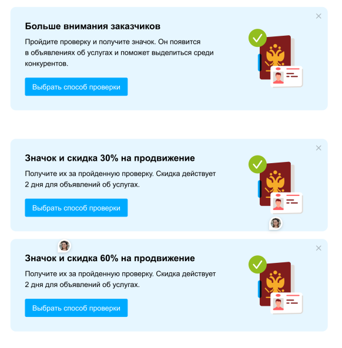

# Бигкейс 2023

## Контекст

Верификация аккаунтов продавцов на Авито — отличный способ повысить доверие к площадке и долю качественных аккаунтов.

**Что такое верификация?**  
Это процесс подтверждения личности владельца аккаунта.  
- Для частников: Live фото с паспортом.  
- Для бизнеса: проверка ИНН юрлица.

Пользователи мотивируются к верификации:
- значок в профиле и объявлении;
- больше доверия → больше просмотров и заказов.

> Сейчас тестируются новые способы мотивации пройти верификацию.

---

## Эксперимент

**Идея**: Выдача скидки за прохождение верификации.

> "Вы верифицируете аккаунт, а мы дарим вам временную скидку. Все в выигрыше"

### Сегмент

- Продавцы из вертикали 1, без верификации.
- Активные (было хотя бы одно активное объявление).
- Разделены на 3 группы.

### Воздействие

1. **Группа `no_discount`**
    - Рассылка: верификация → значок.
    - При верификации: значок.

2. **Группа `30_discount`**
    - Рассылка: верификация → значок + 30% скидка на 3 типа услуг в категории 1, на 2 дня.
    - При верификации: значок + скидка 30%.

3. **Группа `60_discount`**
    - Рассылка: верификация → значок + 60% скидка на 3 типа услуг в категории 1, на 2 дня.
    - При верификации: значок + скидка 60%.

> 📅 **Старт эксперимента:** 15 сентября 2021

### Примеры посылов  

## Задача

1. Сформулируйте гипотезы для эксперимента.
   - Что нужно исследовать, чтобы понять успешность акции?
   - ❗ Делается **до** эксперимента!

2. Проверьте, сбалансированы ли экспериментальные группы.

3. Исследуйте результаты:
   - a. Проведите необходимые расчёты.
   - b. Сделайте исследование.
   - c. Оформите документ с:
     - Сетапом эксперимента
     - Основными гипотезами
     - Расчётами и аргументацией
     - Итогами и рекомендациями
     - Ясностью для бизнеса **и** аналитиков

---

## Данные

### Подключение к базе данных

- `host`: `46.34.136.91` (из офиса: `10.255.255.9`)
- `port`: `25432` (или `5432` из офиса)
- `database`: `postgres`
- `user`: `<USER>`
- `password`: `<PASSWORD>`

---

### Таблицы

#### `PUBLIC.services_verification_experiment_segment`

| Колонка | Описание |
|--------|----------|
| `user_id` | уникальный ID пользователя |
| `experiment_group` | группа эксперимента |
| `UserType` | Физ. лицо или компания |
| `RegistrationTime` | дата регистрации аккаунта |

#### `PUBLIC.services_verification_discounts`

| Колонка | Описание |
|--------|----------|
| `user_id` | ID пользователя |
| `item_id` | ID объявления |
| `discount_day` | дата выдачи скидки/верификации |
| `experiment` | не используется |

#### `PUBLIC.user_payments_info`

| Колонка | Описание |
|--------|----------|
| `user_id` | кто покупал? |
| `item_id` | на какое объявление? |
| `event_time` | дата покупки |
| `transaction_type` | тип покупки |
| `transaction_subtype` | подтип |
| `amount_net` | сумма |

#### `PUBLIC.user_item_info`

| Колонка | Описание |
|--------|----------|
| `item_id` | ID объявления |
| `user_id` | ID пользователя |
| `item_vertical` | категория |
| `item_region` | регион |
| `item_creation_time` | дата создания |

